<div align="center">


<a href="https://www.linkedin.com/in/sarthakyadav1/"></a>
<a href="https://sarthak-yadav-portfolio.netlify.app/"></a>
<a href="mailto:sarthakyadavv1@gmail.com"></a>
<a href="https://github.com/Sarthakyadav98"></a>


</div>

---

## `$ whoami`

I build software that eventually has to survive production.

Over the past few years I've worked with early-stage teams and products across **EdTech, SaaS, HealthTech, DentalTech, and marketplaces** — including **BlinkGrid, Denvak, Tabeeb, and SpareItUp**.

Most of my work lives somewhere around here:

<div align="center">
  
</div>


I like figuring out what happens when the boxes in that diagram stop talking to each other.

That curiosity has pulled me deeper into **backend architecture, distributed systems, observability, databases, concurrency, and systems programming.**

---

## `$ shipped-with`

<div align="center">

| Project | Domain | Status |
|---|---|---|
| **TestCrack** | EdTech / SaaS | 🟢 Live |
| **Denvak** | DentalTech | 🟢 Live |
| **Tabeeb** | HealthTech | 🟢 Live |
| **SpareItUp** | Marketplace | 🟢 Live |

</div>

Mostly early-stage teams, where "engineering" means going beyond implementation:

**understand the problem → design the system → build it → ship it → figure out why it broke in production.**

That last part is the fun part.

---

## `$ ls ~/projects --sort=impact`

<details open>
<summary><b>01. tabeeb/</b> — Production healthcare platform</summary>
<br>

A multi-role healthcare system supporting consultations, clinic appointments, lab bookings, digital prescriptions, payments, wallets, and patient management.

`TypeScript` `Express` `PostgreSQL` `Redis` `WebSockets` `JWT` `NGINX`

Worked on transactional workflows, real-time communication, idempotent request handling, auth, DB design, and production deployments.

</details>

<details>
<summary><b>02. cpp-memory-allocator/</b> — <code>malloc()</code>, but I wanted to understand what's underneath</summary>
<br>

A custom heap allocator in C++:

```
free lists
├── block splitting
├── block coalescing
├── memory alignment
└── fragmentation management
```

Benchmarked against standard `malloc/free` across varying workloads, validated with stress tests and memory integrity checks.

</details>

<details>
<summary><b>03. HiPLIS/</b> — because processing millions of log lines sequentially sounded boring</summary>
<br>

A high-performance log intelligence system exploring parallel processing and performance optimization.

`C++` `OpenMP` `STL` `Multithreading`

Parallelized log parsing, aggregation, and anomaly detection while benchmarking scalability and thread utilization.

**Peak benchmarked speedup: ~6.5× over serial execution.** 🔥

</details>

---

## `$ cat current-rabbit-holes.txt`

```
backend/            distributed-systems/    systems/
├── architecture    ├── consistency         ├── memory management
├── API design      ├── replication         ├── concurrency
├── databases       ├── failure modes       ├── processes & threads
├── caching         ├── async processing    ├── networking
└── real-time       └── observability       └── linux

engineering/                          machine-learning/
├── scalability                       └── figuring out where it
├── reliability                          actually belongs in
├── performance                          production systems
└── "what breaks at 100x traffic?"
```

Not collecting technologies. Trying to understand **why systems are designed the way they are.**

---

## `$ stack --daily`

<div align="center">


</div>

```
concepts   System Design · Database Design · OOP
           Operating Systems · Computer Networks
```

Tools change. Fundamentals compound.

---

## `$ git log --oneline --life`

```
HEAD      going deeper into backend & systems
HEAD~1    shipping production software
HEAD~2    breaking abstractions to understand them
HEAD~3    probably debugging something
...
```

---

## `$ stats --live`

<div align="center">


</div>

---

## `$ cat elsewhere.txt`

```
🎓  IIIT Kottayam
🧠  Amazon ML Summer School '26
⭐  CodeChef 3★
💡  500+ algorithmic problems solved
```

---

<div align="center">

### build. break. understand. repeat.


<br><br>

<a href="https://www.linkedin.com/in/sarthakyadav1/">LinkedIn</a> •
<a href="https://github.com/Sarthakyadav98">GitHub</a> •
<a href="https://sarthak-yadav-portfolio.netlify.app/">Portfolio</a>


</div>
